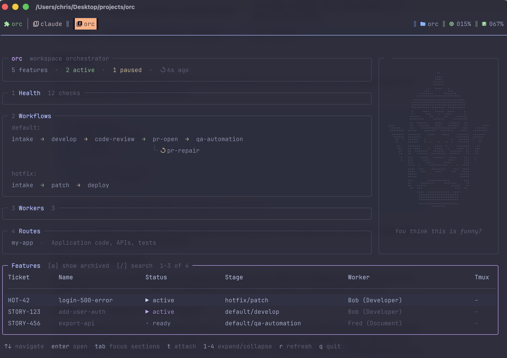

# orc

**The durable workflow layer for coding agents.**

Keep plans, decisions, state, and handoffs alive across agents, sessions, and
repositories. Orc coordinates the work in portable files; tmux and Herdr are
execution backends, not the source of truth.

[](LICENSE)
[](https://github.com/cengebretson/orc/releases/latest)

```
⠀⠀⠀⠀⠀⠀⠀⠀⠀⠀⠀⠀⠀⠀⢀⡀⠀⠀⠀⠀⠀⠀⠀⠀⠀⠀⠀⠀⠀⠀
⠀⠀⠀⠀⠀⠀⠀⠀⠀⠀⠀⠀⠀⢠⣿⣿⡄⠀⠀⠀⠀⠀⠀⠀⠀⠀⠀⠀⠀⠀
⠀⠀⠀⠀⠀⠀⠀⠀⠀⣀⣤⣶⣧⣄⣉⣉⣠⣼⣶⣤⣀⠀⠀⠀⠀⠀⠀⠀⠀⠀
⠀⠀⠀⠀⠀⠀⠀⢰⣿⣿⣿⣿⡿⣿⣿⣿⣿⢿⣿⣿⣿⣿⡆⠀⠀⠀⠀⠀⠀⠀
⠀⠀⠀⠀⠀⠀⠀⣼⣤⣤⣈⠙⠳⢄⣉⣋⡡⠞⠋⣁⣤⣤⣧⠀⠀⠀⠀⠀⠀⠀
⠀⢲⣶⣤⣄⡀⢀⣿⣄⠙⠿⣿⣦⣤⡿⢿⣤⣴⣿⠿⠋⣠⣿⠀⢀⣠⣤⣶⡖⠀
⠀⠀⠙⣿⠛⠇⢸⣿⣿⡟⠀⡄⢉⠉⢀⡀⠉⡉⢠⠀⢻⣿⣿⡇⠸⠛⣿⠋⠀⠀
⠀⠀⠀⠘⣷⠀⢸⡏⠻⣿⣤⣤⠂⣠⣿⣿⣄⠑⣤⣤⣿⠟⢹⡇⠀⣾⠃⠀⠀⠀
⠀⠀⠀⠀⠘⠀⢸⣿⡀⢀⠙⠻⢦⣌⣉⣉⣡⡴⠟⠋⡀⢀⣿⡇⠀⠃⠀⠀⠀⠀
⠀⠀⠀⠀⠀⠀⢸⣿⣧⠈⠛⠂⠀⠉⠛⠛⠉⠀⠐⠛⠁⣼⣿⡇⠀⠀⠀⠀⠀⠀
⠀⠀⠀⠀⠀⠀⠸⣏⠀⣤⡶⠖⠛⠋⠉⠉⠙⠛⠲⢶⣤⠀⣹⠇⠀⠀⠀⠀⠀⠀
⠀⠀⠀⠀⠀⠀⠀⠀⠀⢹⣿⣶⣿⣿⣿⣿⣿⣿⣶⣿⡏⠀⠀⠀⠀⠀⠀⠀⠀⠀
⠀⠀⠀⠀⠀⠀⠀⠀⠀⠈⠉⠉⠉⠛⠛⠛⠛⠉⠉⠉⠁⠀⠀⠀⠀⠀⠀⠀⠀⠀

orc · workspace orchestrator
```

See the dashboard with no setup or workspace required:

```bash
orc demo
```



The screenshot shows the unified dashboard's Workspace section. `orc demo`
starts in Live with synthetic work, so you can explore without creating a
workspace or launching an agent.

## What it does

Agentic workflows break down at the session boundary. An agent finishes a task,
the session ends, and the next agent starts cold — no memory of what was decided,
what was built, or what still needs fixing.

`orc` fixes this with a **feature folder**: a durable context pack that travels
with the ticket. Every stage reads what the previous one wrote and writes its own
outputs into a named subfolder. Any agent — or human — can pick up mid-flight and
know exactly where things stand without asking anyone.

**Context survives everything.** Session ends, agent switches, restarts — the
feature folder is the source of truth. `orc next <ticket>` gives any agent a
complete picture in seconds.

**Each stage has one job and clear handoffs.** Stage docs define inputs, outputs,
exit criteria, and the exact `orc mark` command to run when done. Agents don't
decide what to do next — the workspace tells them.

**Policy lives in files, not code.** `orc.yaml` declares stage order, default
workers, advance mode, repo setup commands, and required feature artifacts. Stage
docs are plain markdown. Change review criteria, add a preflight check, swap
models — edit the file and the next session picks it up immediately.

**Handoffs can be enforced.** Stages can declare `required_artifacts` such as
`PLAN.md`, `develop/HANDOFF.md`, or `qa-automation/RESULT.md`. In the default
`warn` mode, `orc artifacts <ticket>` reports missing artifacts. With
`artifact_policy: block`, `orc mark <ticket> next` refuses to advance until the
current stage's artifacts are ready.

**Right agent for each job.** A fast model for implementation, a smarter one for
review, a specialist for QA. Each worker is a markdown file. Use `--worker` to
override for a single run.

**Repo setup stays repo-specific.** Repos can define `worktree_setup` and
`agent_hints` in `orc.yaml`, so agents see the correct checkout command and local
repo conventions without `orc` hardcoding them.

**Human-in-the-loop where it counts.** `orc mark <ticket> pause` creates explicit
review gates. Agents call it when they need a human decision. `orc next <ticket>`
continues when you're ready.

**Agent-agnostic by design.** Works with Claude, Codex, or anything that can read
a file and run a shell command. No SDK dependency, no lock-in.

See [How Orc compares](docs/comparison.md) for the boundary between Orc and
agent platforms, terminal control planes, multiplexers, and IDEs.

## Install

Download a binary archive from the
[releases page](https://github.com/cengebretson/orc/releases), verify it with
the release `checksums.txt`, and put `orc` somewhere on your `PATH`.

Or install with Go:

```bash
go install github.com/cengebretson/orc/cmd/orc@latest
```

Or build from source (`make build` stamps the version from the latest git tag):

```bash
git clone git@github.com:cengebretson/orc.git
cd orc
make build
```

## Shell completions

`orc` can generate shell completions:

```bash
orc completion bash
orc completion fish
orc completion zsh
```

For Fish, install and load the generated script with:

```fish
mkdir -p ~/.config/fish/completions
orc completion fish > ~/.config/fish/completions/orc.fish
source ~/.config/fish/completions/orc.fish
```

The Fish script asks the installed `orc` binary for completion data, so
configured repository names and installed workers stay current automatically.

## Dependencies

Release binaries do not require Go. A working Orc workspace needs `git` plus at
least one configured agent CLI (`claude` or `codex`); building from source needs
Go 1.24.2 or newer. Two optional tools unlock additional features:

| Tool | Purpose | Install |
|------|---------|---------|
| `tmux` | Session management — `orc work` launches and attaches agent sessions | `brew install tmux` |
| `chafa` | Character-art portraits in `orc dashboard` (`!` character sheet) on terminals without Kitty graphics support | `brew install chafa` |

**Pixel portraits:** on kitty and Ghostty, `orc dashboard` renders portraits as true
pixel images natively (Kitty graphics protocol, Unicode placeholders) — no
extra tools needed. Inside tmux, add this to your `tmux.conf` so the one-time
image transmission reaches the outer terminal:

```
set -g allow-passthrough on
```

Without it — or on other terminals — portraits fall back to chafa character
art, then to built-in ASCII art if chafa is not installed. Set
`ORC_PORTRAIT=symbols` or `ORC_PORTRAIT=kitty` to override the detection.

**Colors:** the dashboard and watch rail default to the built-in
`catppuccin-mocha` theme. Set `settings.theme: terminal` in `orc.yaml` to derive
them from your terminal's own palette instead — accent colors become ANSI slots
your terminal maps, and body text is left unset so its default foreground shows
through, which keeps it readable on light and dark backgrounds alike.
`orc doctor` reports an unknown theme name and lists the valid ones.

## Getting started

### 1. Scaffold a workspace

```bash
orc init
```

Run it and confirm the workspace path (default: current directory). Orc installs
the `default` starter pack; a pack is a reusable bundle of workflows, stages,
workers, and aliases. Use `--skip-default-pack` when you want only the base
workspace scaffold.

`orc init` installs the chosen pack into `packs/<name>/`, copies its runtime
workers and stages into `workers/` and `stages/`, and merges its workflow
definitions into `orc.yaml`. Use `--skip-default-pack` for a base-only workspace
you will wire up yourself or extend later with `orc pack install`.

```bash
orc pack available                                # see built-in packs
orc pack inspect ./packs/hotfix                   # validate a local pack before install
orc init --workspace ~/my-workspace
orc init --workspace ~/bare-workspace --skip-default-pack
cd ~/bare-workspace
orc pack install default                           # install later into the current workspace
orc pack install ./packs/hotfix                    # install a local pack
orc pack list                                      # show installed packs and active workflows
orc pack show default                              # inspect one installed pack
```

### 2. Run setup

Let an agent configure the workspace for your ticketing system, repositories,
workflow, and preferred agent engines:

```bash
cd ~/my-workspace
claude "Read SETUP.md and perform the workspace setup"
# or: codex "Read SETUP.md and perform the workspace setup"
```

The agent inspects the installed pack, local repositories, repo instructions,
and available tools first. It then asks once for the preferences it cannot infer,
makes the workspace edits itself, and runs `orc doctor` to verify them. You should
not need to copy configuration snippets or work through a field-by-field wizard.

### 3. Check readiness

```bash
orc doctor
orc doctor --system
orc hooks install --dry-run
orc hooks install
```

`orc doctor` checks workspace files plus local readiness: configured worker
engines on your `PATH`, tmux availability, agent-hook readiness, and any
`STATE.yaml.lock` files that could affect ticket updates. Add `--fix` to
remove provably-stale locks (dead PID, or old without a valid PID) — live locks
are never touched.

`orc doctor --system` checks install-level readiness outside a workspace:
`orc` on `PATH`, the build version, tmux, chafa, and the supported agent CLIs.

`orc hooks install` merges Orc-owned lifecycle handlers into Codex's
`hooks.json` and Claude's `settings.json`. It is a separate command rather than
a `doctor` flag because it writes into your agent configuration rather than the
workspace — `orc doctor` reports whether the hooks are installed, and this
installs them. Preview the exact file operations with `--dry-run` first. Codex
requires explicit review and trust through `/hooks`; Orc never approves hook
hashes on your behalf. The installed fail-open Bash wrapper forwards the
provider's JSON event to `orc agent-event`; Orc itself parses and normalizes the
payload, so the hooks do not require Python, `jq`, or another JSON runtime.
Restart active Claude sessions after installation.

### 4. Start working on a ticket

```bash
orc work STORY-123
```

This creates `features/STORY-123/` and immediately prints the intake agent
launch command. Run it — the agent fetches the ticket, populates `TICKET.md`,
`SPEC.md`, and `PLAN.md`, and updates `STATE.yaml` to `status: pending`.

### 5. Continue work

```bash
orc next STORY-123
```

Launches the agent for the current stage. The agent works, updates `STATE.yaml`,
and exits. Run `orc next` again for the next stage. Use `--dry` to preview the
launch command without executing it.

You can also use the dashboard:

```bash
orc dashboard
```

## Example workflow

### Stages and workers

`features/STORY-123/` is the durable handoff between agents — each writes state when done, the next picks up from the same folder. Different stages can use different workers and models.


Workers are markdown files in `workers/`. Each stage in `orc.yaml` names a worker — mix models and agents freely. Use `--worker` to override for a single run. Loop stages (`code-review`, `pr-repair`) are configured under the pipeline stage that owns the loop, not as separate linear steps.

`auto` — agent calls `orc mark <ticket> next`, and `orc next <ticket>` launches the next stage  
`manual` — agent calls `orc mark <ticket> pause`; a human approves before continuing

Stages may also declare `required_artifacts`. `orc next` reminds agents about
them, `orc artifacts <ticket>` reports missing or empty files, and
`settings.artifact_policy: block` makes `orc mark <ticket> next` enforce them.

---

### Agent session loop


State is always written to `STATE.yaml` before the session ends — the next agent
or human picks up exactly where the last one left off.

When a session is paused (`orc mark <ticket> pause`), the reason is recorded in history and status is set to `paused`. Running `orc next <ticket>` again will show the pause reason and offer to relaunch with a recovery prompt built from the current feature context — so the agent resumes with full awareness of what was in progress and why it stopped.

---

### Local runs

`orc run` creates and immediately launches a normal feature for work that has
no external tracker ticket:

```bash
orc run "Investigate the intermittent API timeout"

# Skip the prompts and enter the tmux session immediately.
orc run --repo api --worker default:bob --attach "Investigate the timeout"
```

Orc assigns the next workspace-local ID (`LOCAL-1`, `LOCAL-2`, ...), derives a
short slug from the instruction, and uses the single-stage `default:adhoc`
workflow. The example creates
`features/LOCAL-1-investigate-the-intermittent-api-timeout/`; the original
instruction remains verbatim in `TICKET.md` and the launch prompt. Use `--slug`
only when the derived name needs an override.

Local features use the same state, history, lifecycle hooks, rail, attach,
focus, prompt, resume, completion, and archive paths as tracked work. Pass
`--tmux` to launch in the selected multiplexer, or set
`settings.auto_tmux: true` for the workspace default.
`--attach` implies multiplexer launch and enters the new session immediately.
When `--worker` is omitted, Orc prompts for one. When `--repo` is omitted, Orc
selects the only configured repository, infers the repository containing the
current directory, or prompts with the configured repositories and a workspace
root option. Non-interactive use requires explicit flags when a choice cannot
be inferred.

The launch prompt includes the exact completion signal,
`orc mark LOCAL-N done --result "<summary of what was done>"`. Completion
records the durable result; `orc archive LOCAL-N` later removes its tmux session
and archives the feature.
On an older workspace, the first run adds the missing workflow and stage guide
without replacing existing workflow configuration or stage files.

---

### JIT tasks

`orc jit` runs a one-off agent task that doesn't belong in the pipeline — a spot check, a secondary review, an exploratory investigation — without touching the stage or status.

```bash
orc jit STORY-123 --worker default:zach "make sure the auth middleware handles token expiry correctly"
```

The agent gets the same orientation prompt as `orc next` (reads `STATE.yaml`, `TICKET.md`, `SPEC.md`), then does the task; output lands in `features/<slug>/jit/<timestamp>/`. `runtime.jit` is written before launch so the task shows up in `orc status` and the dashboard:

```
STORY-123   active   default:standard · default:develop + jit   default:bob
```

When done, the agent runs `orc mark STORY-123 jit "<summary>"`, which appends history and clears `runtime.jit`. Only one jit task runs at a time — clear it first to start another. Use `--dry` to preview and `--tmux` to send the task to the ticket's existing tmux session.

---

### Helpful plugins

These tools work well alongside `orc` and are worth setting up before you start.

#### context-mode

[context-mode](https://github.com/mksglu/context-mode) keeps large tool outputs out of the context window — only summaries land in context, while raw output stays in a searchable local knowledge base. It matters here because orc sessions are long: agents read `STATE.yaml`, stage docs, history, and file trees, and without it that output crowds out earlier context.

Install once, then it runs automatically in every session:

```bash
claude mcp add context-mode -- npx -y @context-mode/mcp@latest
```

Enable in settings:

```json
{
  "enabledPlugins": {
    "context-mode@context-mode": true
  }
}
```

Key commands: `/ctx-stats` to see how much context was saved, `/ctx-upgrade` to update.

---

#### GitHub MCP

The [GitHub MCP server](https://github.com/github/github-mcp-server) gives agents native access to GitHub — PRs, issues, review comments, CI status — without shelling out to `gh`. It matters most during `pr-open`, `pr-repair`, and `code-review`, where agents read PR state, post review comments, and check CI directly.

Install:

```bash
claude mcp add github -s user -- docker run -i --rm -e GITHUB_PERSONAL_ACCESS_TOKEN ghcr.io/github/github-mcp-server
```

Or use the Claude Desktop settings UI. Requires a GitHub PAT with `repo` and `pull_requests` scopes. Once connected, agents use `mcp__github__*` tools automatically when they need PR or issue context — no stage-doc changes required.

---

## Gallery

### Dashboard (`orc dashboard`)

The dashboard keeps Live operations and workspace exploration in one Bubble Tea
application with top-level Live, Workflows, Workers, Repositories, and
Health tabs. `[`/`]` cycles tabs and `1`–`5` jumps directly to one without
discarding loaded data, filters, or selection. At widths below 56 columns the
dashboard hides configuration tabs and switches to the compact Live rail;
widening restores the previously selected tab. Health becomes
`HEALTH ⚠ N` when checks need attention. Health opens directly with a pinned
summary and scrollable grouped checks, while the operational banner on the
Live, Workflows, and Workers tabs reports total features, running sessions,
paused work, and items needing attention. Repositories opens directly into a
pinned routing summary with responsive repository and route cards. Features
refreshes live session telemetry every two seconds while full Workspace and
Health discovery retains the slower
`settings.workspace_refresh` interval. `orc watch` remains the dedicated compact
Live rail; `orc dashboard` starts in Live. Press `?` for navigation help.

---

## Commands

`orc --help` is the authoritative top-level command list. Use
`orc <command> --help` for flags and subcommands, and `orc help-all` to include
agent-only commands.

Available globally:

- `--workspace <path>` — workspace root (default: current directory)
- `--mux <tmux|herdr>` — backend selected from recorded runtime, then tmux

| Area | Commands | Purpose |
|------|----------|---------|
| Setup | `init`, `pack`, `doctor`, `hooks install`, `completion`, `version` | Create and validate workspaces, manage packs, install lifecycle hooks, and inspect the build. |
| Workflow | `work`, `next`, `status`, `artifacts`, `label`, `answer` | Create, launch, inspect, and update durable ticket work. |
| History | `report`, `archive`, `delete` | Report time in stage and retire completed work. `delete` only accepts `done` or `archived` tickets. |
| Live work | `sessions`, `attach`, `focus`, `watch`, `rail`, `dashboard`, `demo` | Inventory, resume, monitor, navigate exact live sessions, or preview synthetic work. |
| One-off work | `run`, `jit` | Create standalone local work or add a side task to an existing feature. |
| Integrations | `ctl`, `events` | Read and control exact recorded agents or follow workspace changes as JSONL. |
| Discovery | `help`, `help-all` | Show human commands or the complete human-plus-agent surface. |

High-value references:

- [Workflow configuration](docs/workflows.md) covers validation, artifact policy,
  and the `orc mark` state transitions agents use instead of editing `STATE.yaml`.
- [Sessions](docs/sessions.md) covers inventory, exact resume, and park/unpark.
- [Watch and rail](docs/watch.md) covers live filtering, prompts, attach/focus, and
  tmux presentation.
- [Events](docs/events.md) covers the feature, attention, session, and stage
  change stream.
- [Comparison](docs/comparison.md) defines Orc's scope relative to adjacent
  agent and terminal tools.
- [Tmux](docs/tmux.md), [Herdr](docs/herdr.md), and
  [agent detection](docs/agent-detection.md) document backend behavior.

`orc agent-event` is intentionally hidden and called only by installed lifecycle
hooks. Structured control keeps lifecycle state authoritative; terminal capture
is diagnostic text, not agent state.

## Reference

Deep reference lives in **[docs/reference.md](docs/reference.md)**:

- **[Project context](CONTEXT.md)** — the authoritative Orc developer glossary and durable terminology decisions
- **[Decision records](docs/adr/)** — why the load-bearing architectural decisions are what they are
- **[Workspace layout](docs/reference.md#workspace-layout)** — the full file tree `orc init` scaffolds
- **[Workspace files](docs/reference.md#workspace-files)** — owner and purpose of each root file (`AGENTS.md`, `ORC.md`, `RULES.md`, …)
- **[Feature folder](docs/reference.md#feature-folder)** — the per-ticket context pack and who reads/writes each file
- **[orc.yaml](docs/reference.md#orcyaml)** — repos, workflows, loop stages, and settings (configuration deep-dive in **[docs/workflows.md](docs/workflows.md)**)
- **[STATE.yaml](docs/reference.md#stateyaml)** — the per-ticket state machine, status values, and runtime/lock semantics
- **[Sessions](docs/sessions.md)** — live telemetry, managed/orphan classification, exact resume, and park/unpark safety
- **[Live watch and rail](docs/watch.md)** — attention-aware session monitoring, filtering, interaction, and tmux presentation
- **[Tmux integration](docs/tmux.md)** — optional popup, split-pane, resume, and focus bindings
- **[Tmux fallback detection](docs/agent-detection.md)** — versioned title/screen rules, local overrides, precedence, and safety boundaries
- **[Herdr integration](docs/herdr.md)** — native workspace/agent launch, exact attach, lifecycle inventory, and sidebar tokens
- **[Events](docs/events.md)** — followable feature, attention, session, and stage changes with a JSONL schema
- **[Release readiness](docs/release.md)** — pinned non-publishing snapshot validation, disposable-workspace QA, and tag verification
- **[Workers](docs/reference.md#workers)** — worker definition files, prompt construction, and resolution order

---

## Further reading

- [Context Loss: Why Your AI Coding Agent Forgets](https://cleanaim.com/silent-wiring/problems/context-loss/) — CleanAim
- [Agent Memory vs. Context Engineering: What Persists Between Sessions](https://www.augmentcode.com/guides/agent-memory-vs-context-engineering) — Augment Code
- [Codified Context: Infrastructure for AI Agents in a Complex Codebase](https://arxiv.org/abs/2602.20478) — arXiv 2026
