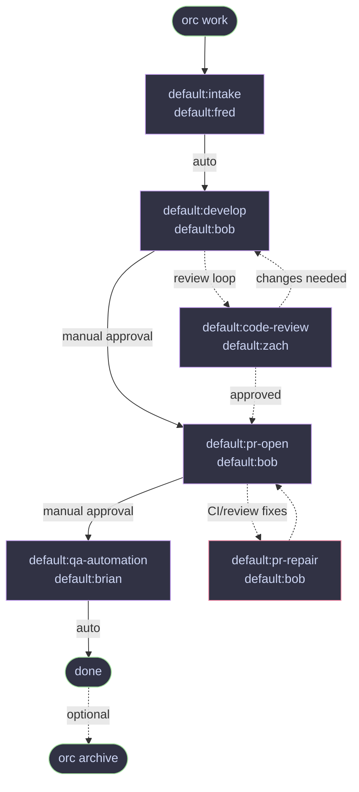
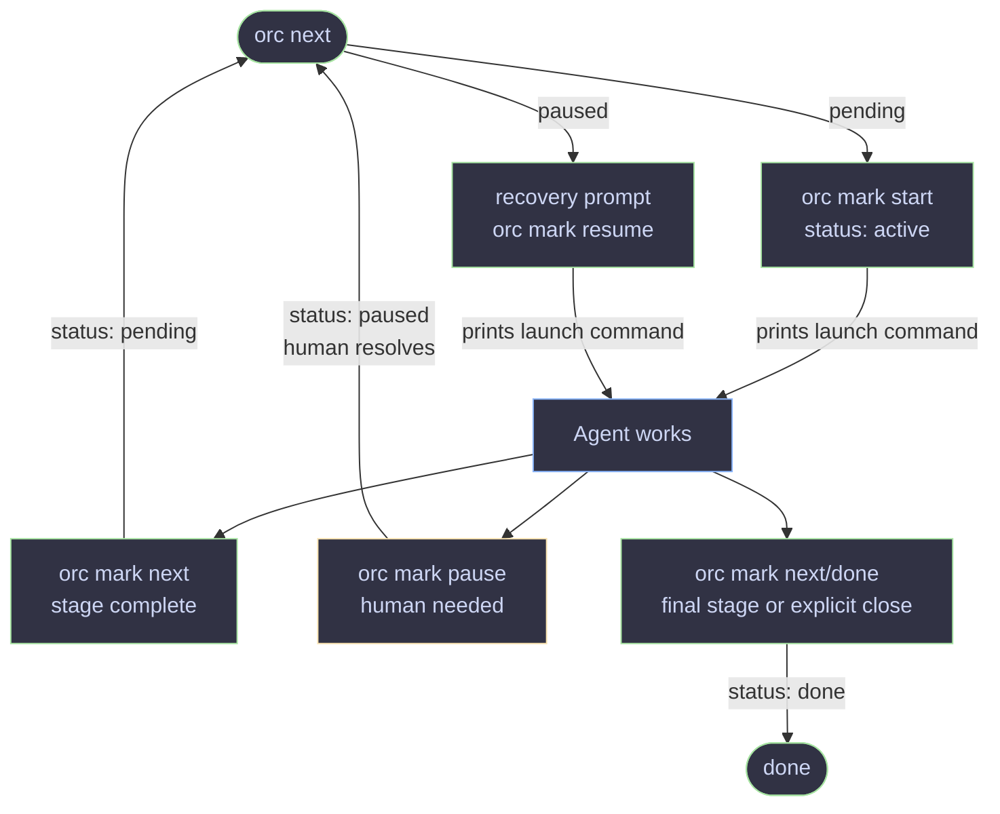

# orc

Keep feature work moving across agents, sessions, and repos — without losing context.

```
⠀⠀⠀⠀⠀⠀⠀⠀⠀⠀⠀⠀⠀⠀⢀⡀⠀⠀⠀⠀⠀⠀⠀⠀⠀⠀⠀⠀⠀⠀
⠀⠀⠀⠀⠀⠀⠀⠀⠀⠀⠀⠀⠀⢠⣿⣿⡄⠀⠀⠀⠀⠀⠀⠀⠀⠀⠀⠀⠀⠀
⠀⠀⠀⠀⠀⠀⠀⠀⠀⣀⣤⣶⣧⣄⣉⣉⣠⣼⣶⣤⣀⠀⠀⠀⠀⠀⠀⠀⠀⠀
⠀⠀⠀⠀⠀⠀⠀⢰⣿⣿⣿⣿⡿⣿⣿⣿⣿⢿⣿⣿⣿⣿⡆⠀⠀⠀⠀⠀⠀⠀
⠀⠀⠀⠀⠀⠀⠀⣼⣤⣤⣈⠙⠳⢄⣉⣋⡡⠞⠋⣁⣤⣤⣧⠀⠀⠀⠀⠀⠀⠀
⠀⢲⣶⣤⣄⡀⢀⣿⣄⠙⠿⣿⣦⣤⡿⢿⣤⣴⣿⠿⠋⣠⣿⠀⢀⣠⣤⣶⡖⠀
⠀⠀⠙⣿⠛⠇⢸⣿⣿⡟⠀⡄⢉⠉⢀⡀⠉⡉⢠⠀⢻⣿⣿⡇⠸⠛⣿⠋⠀⠀
⠀⠀⠀⠘⣷⠀⢸⡏⠻⣿⣤⣤⠂⣠⣿⣿⣄⠑⣤⣤⣿⠟⢹⡇⠀⣾⠃⠀⠀⠀
⠀⠀⠀⠀⠘⠀⢸⣿⡀⢀⠙⠻⢦⣌⣉⣉⣡⡴⠟⠋⡀⢀⣿⡇⠀⠃⠀⠀⠀⠀
⠀⠀⠀⠀⠀⠀⢸⣿⣧⠈⠛⠂⠀⠉⠛⠛⠉⠀⠐⠛⠁⣼⣿⡇⠀⠀⠀⠀⠀⠀
⠀⠀⠀⠀⠀⠀⠸⣏⠀⣤⡶⠖⠛⠋⠉⠉⠙⠛⠲⢶⣤⠀⣹⠇⠀⠀⠀⠀⠀⠀
⠀⠀⠀⠀⠀⠀⠀⠀⠀⢹⣿⣶⣿⣿⣿⣿⣿⣿⣶⣿⡏⠀⠀⠀⠀⠀⠀⠀⠀⠀
⠀⠀⠀⠀⠀⠀⠀⠀⠀⠈⠉⠉⠉⠛⠛⠛⠛⠉⠉⠉⠁⠀⠀⠀⠀⠀⠀⠀⠀⠀

orc · workspace orchestrator
```

## What it does

Agentic workflows break down at the session boundary. An agent finishes a task,
the session ends, and the next agent starts cold — no memory of what was decided,
what was built, or what still needs fixing.

`orc` fixes this with a **feature folder**: a durable context pack that travels
with the ticket. Every stage reads what the previous one wrote and writes its own
outputs into a named subfolder. Any agent — or human — can pick up mid-flight and
know exactly where things stand without asking anyone.

**Context survives everything.** Session ends, agent switches, restarts — the
feature folder is the source of truth. `orc next <ticket>` gives any agent a
complete picture in seconds.

**Each stage has one job and clear handoffs.** Stage docs define inputs, outputs,
exit criteria, and the exact `orc mark` command to run when done. Agents don't
decide what to do next — the workspace tells them.

**Policy lives in files, not code.** `orc.yaml` declares stage order, default
workers, advance mode, repo setup commands, and required feature artifacts. Stage
docs are plain markdown. Change review criteria, add a preflight check, swap
models — edit the file and the next session picks it up immediately.

**Handoffs can be enforced.** Stages can declare `required_artifacts` such as
`PLAN.md`, `develop/HANDOFF.md`, or `qa-automation/RESULT.md`. In the default
`warn` mode, `orc validate` reports missing artifacts. With
`artifact_policy: block`, `orc mark <ticket> next` refuses to advance until the
current stage's artifacts are ready.

**Right agent for each job.** A fast model for implementation, a smarter one for
review, a specialist for QA. Each worker is a markdown file. Use `--worker` to
override for a single run.

**Repo setup stays repo-specific.** Repos can define `worktree_setup` and
`agent_hints` in `orc.yaml`, so agents see the correct checkout command and local
repo conventions without `orc` hardcoding them.

**Human-in-the-loop where it counts.** `orc mark <ticket> pause` creates explicit
review gates. Agents call it when they need a human decision. `orc next <ticket>`
continues when you're ready.

**Agent-agnostic by design.** Works with Claude, Codex, or anything that can read
a file and run a shell command. No SDK dependency, no lock-in.

## Install

Download a binary archive from the
[releases page](https://github.com/cengebretson/orc/releases), verify it with
the release `checksums.txt`, and put `orc` somewhere on your `PATH`.

Or install with Go:

```bash
go install github.com/cengebretson/orc/cmd/orc@latest
```

Or build from source (`make build` stamps the version from the latest git tag):

```bash
git clone git@github.com:cengebretson/orc.git
cd orc
make build
```

## Shell completions

`orc` can generate shell completions:

```bash
orc completion bash
orc completion fish
orc completion zsh
```

Follow the printed instructions for your shell to install the generated
completion script.

## Dependencies

`orc` itself has no runtime dependencies beyond Go. Two optional tools unlock
additional features:

| Tool | Purpose | Install |
|------|---------|---------|
| `tmux` | Session management — `orc work` launches and attaches agent sessions | `brew install tmux` |
| `chafa` | Character-art portraits in `orc tui` (`!` character sheet) on terminals without Kitty graphics support | `brew install chafa` |

**Pixel portraits:** on kitty and Ghostty, `orc tui` renders portraits as true
pixel images natively (Kitty graphics protocol, Unicode placeholders) — no
extra tools needed. Inside tmux, add this to your `tmux.conf` so the one-time
image transmission reaches the outer terminal:

```
set -g allow-passthrough on
```

Without it — or on other terminals — portraits fall back to chafa character
art, then to built-in ASCII art if chafa is not installed. Set
`ORC_PORTRAIT=symbols` or `ORC_PORTRAIT=kitty` to override the detection.

## Getting started

### 1. Scaffold a workspace

```bash
orc init
```

Run it and answer two questions: workspace path (default: current directory)
and which starter pack to install. A pack is a reusable bundle of workflows,
stages, workers, and aliases. `default` is assumed.

`orc init` installs the chosen pack into `packs/<name>/`, copies its runtime
workers and stages into `workers/` and `stages/`, and merges its workflow
definitions into `orc.yaml`. Use `--skip-default-pack` for a base-only workspace
you will wire up yourself or extend later with `orc pack install`.

```bash
orc pack available                                # see built-in packs
orc pack inspect ./packs/hotfix                   # validate a local pack before install
orc init --workspace ~/my-workspace
orc init --workspace ~/bare-workspace --skip-default-pack
cd ~/bare-workspace
orc pack install default                           # install later into the current workspace
orc pack install ./packs/hotfix                    # install a local pack
orc pack list                                      # show installed packs and active workflows
orc pack show default                              # inspect one installed pack
```

### 2. Run setup

Let an agent configure the workspace for your ticketing system, source control,
and preferred agents:

```bash
cd ~/my-workspace
claude "Read SETUP.md and follow the setup instructions"
# or: codex "Read SETUP.md and follow the setup instructions"
```

The agent will ask about your ticket system (Jira, GitHub Issues, etc.), repos,
and which Claude/Codex model to use for each stage. It creates worker files and
updates `ROUTER.md` with the right ticket system retrieval instructions.

### 3. Check readiness

```bash
orc doctor
orc doctor --system
```

`orc doctor` checks workspace files plus local readiness: configured worker
engines on your `PATH`, tmux availability, and any `STATE.yaml.lock` files
that could affect ticket updates. Add `--fix` to remove provably-stale locks
(dead PID, or old without a valid PID) — live locks are never touched.

`orc doctor --system` checks install-level readiness outside a workspace:
`orc` on `PATH`, the build version, tmux, chafa, and the supported agent CLIs.

### 4. Start working on a ticket

```bash
orc work STORY-123
```

This creates `features/STORY-123/` and immediately prints the intake agent
launch command. Run it — the agent fetches the ticket, populates `TICKET.md`,
`SPEC.md`, and `PLAN.md`, and updates `STATE.yaml` to `status: pending`.

### 5. Continue work

```bash
orc next STORY-123
```

Launches the agent for the current stage. The agent works, updates `STATE.yaml`,
and exits. Run `orc next` again for the next stage. Use `--dry` to preview the
launch command without executing it.

You can also use the dashboard:

```bash
orc tui
```

## Example workflow

### Stages and workers

`features/STORY-123/` is the durable handoff between agents — each writes state when done, the next picks up from the same folder. Different stages can use different workers and models.



Workers are markdown files in `workers/`. Each stage in `orc.yaml` names a worker — mix models and agents freely. Use `--worker` to override for a single run. Loop stages (`code-review`, `pr-repair`) are configured under the pipeline stage that owns the loop, not as separate linear steps.

`auto` — agent calls `orc mark <ticket> next`, and `orc next <ticket>` launches the next stage  
`manual` — agent calls `orc mark <ticket> pause`; a human approves before continuing

Stages may also declare `required_artifacts`. `orc next` reminds agents about
them, `orc validate` reports missing or empty files, and
`settings.artifact_policy: block` makes `orc mark <ticket> next` enforce them.

---

### Agent session loop



State is always written to `STATE.yaml` before the session ends — the next agent
or human picks up exactly where the last one left off.

When a session is paused (`orc mark <ticket> pause`), the reason is recorded in history and status is set to `paused`. Running `orc next <ticket>` again will show the pause reason and offer to relaunch with a recovery prompt built from the current feature context — so the agent resumes with full awareness of what was in progress and why it stopped.

---

### JIT tasks

`orc jit` runs a one-off agent task that doesn't belong in the pipeline — a spot check, a secondary review, an exploratory investigation — without touching the stage or status.

```bash
orc jit STORY-123 --worker default:zach "make sure the auth middleware handles token expiry correctly"
```

The agent gets the same orientation prompt as `orc next` (reads `STATE.yaml`, `TICKET.md`, `SPEC.md`), then does the task; output lands in `features/<slug>/jit/<timestamp>/`. `runtime.jit` is written before launch so the task shows up in `orc status` and the TUI:

```
STORY-123   active   default:standard · default:develop + jit   default:bob
```

When done, the agent runs `orc mark STORY-123 jit "<summary>"`, which appends history and clears `runtime.jit`. Only one jit task runs at a time — clear it first to start another. Use `--dry` to preview and `--tmux` to send the task to the ticket's existing tmux session.

---

### Helpful plugins

These tools work well alongside `orc` and are worth setting up before you start.

#### context-mode

[context-mode](https://github.com/mksglu/context-mode) keeps large tool outputs out of the context window — only summaries land in context, while raw output stays in a searchable local knowledge base. It matters here because orc sessions are long: agents read `STATE.yaml`, stage docs, history, and file trees, and without it that output crowds out earlier context.

Install once, then it runs automatically in every session:

```bash
claude mcp add context-mode -- npx -y @context-mode/mcp@latest
```

Enable in settings:

```json
{
  "enabledPlugins": {
    "context-mode@context-mode": true
  }
}
```

Key commands: `/ctx-stats` to see how much context was saved, `/ctx-upgrade` to update.

---

#### GitHub MCP

The [GitHub MCP server](https://github.com/github/github-mcp-server) gives agents native access to GitHub — PRs, issues, review comments, CI status — without shelling out to `gh`. It matters most during `pr-open`, `pr-repair`, and `code-review`, where agents read PR state, post review comments, and check CI directly.

Install:

```bash
claude mcp add github -s user -- docker run -i --rm -e GITHUB_PERSONAL_ACCESS_TOKEN ghcr.io/github/github-mcp-server
```

Or use the Claude Desktop settings UI. Requires a GitHub PAT with `repo` and `pull_requests` scopes. Once connected, agents use `mcp__github__*` tools automatically when they need PR or issue context — no stage-doc changes required.

---

## Gallery

### Dashboard (`orc tui`)


---

## Commands

### Human commands

- `orc init` — scaffold a new workspace
  - `--workspace <path>` — scaffold at a specific path
  - `--skip-default-pack` — create the base workspace without installing the default pack
  - `--dry-run` — preview without writing
  - `--force` — overwrite existing files
- `orc pack` — inspect and manage workflow packs
  - `orc pack available` — show built-in packs available for install
  - `orc pack inspect <path>` — validate and preview a local pack without installing it
  - `orc pack install <pack>` — install a built-in pack name or local pack path into the current workspace
  - `orc pack list` — show installed packs, install source, and active workflows
  - `orc pack show <pack>` — show one installed pack snapshot
- `orc doctor` — check workspace health plus `orc.yaml`, local tools, worker engines, tmux, and state locks
- `orc doctor --system` — check install readiness outside a workspace
  - `orc doctor <ticket>` — validate a ticket's `STATE.yaml`: workflow, stage, worker, next action, repos, worktrees, and feature artifacts
  - `--fix` — remove provably-stale state locks (dead PID or old without a valid PID); live locks are never touched
- `orc status` — show all features and their current workflow/stage
  - `orc status <ticket>` — show full details for a specific ticket
  - `--json` — output durable state as JSON for scripting; a matched running provider adds an optional `live` overlay
- `orc sessions` — list managed and orphaned agent sessions with tmux targets and optional provider telemetry
  - `--all` — include recent Claude and Codex sessions not managed by Orc
  - `--json` — emit the inventory as JSON
  - groups rows by repository and branch; managed rows use `STATE.yaml.repos`, while unmanaged rows use cached Git metadata
  - `orc sessions resume` — search recent sessions interactively by provider, model, repository, branch, CWD, and activity
  - `orc sessions resume <provider-session-id> --dry` — validate and preview an exact provider resume
  - `orc sessions park --dry` — preview resumable managed sessions; `--yes` snapshots and stops only those sessions
  - `orc sessions unpark --dry` — preview the saved snapshot; `--yes` recreates and resumes it
- `orc report` — time-in-stage across all tickets (avg/median active time, visit counts), derived from history
  - `orc report <ticket>` — per-stage breakdown for one ticket with total cycle time
  - `--archived` — include archived tickets in the aggregate (no-arg) report
  - `--json` — output as JSON for scripting
- `orc artifacts <ticket>` — check required feature artifacts for the current stage
  - `--all` — check required artifacts across the whole workflow
  - `--json` — output as JSON for scripting
- `orc work <ticket>` — create the feature folder for a ticket
  - `--workflow <name>` — use a named workflow instead of the configured default
  - `--tmux` — also enable a tmux session for this ticket
  - `--next` — create the feature folder and immediately launch the first stage
- `orc next <ticket>` — launch the next agent for a ticket
  - `--dry` — preview the launch command without running it
  - `--json` — next action as JSON for CI or scripting
  - `--worker <id>` — override the selected worker for one launch
- `orc jit <ticket> --worker <id> "<instruction>"` — run a one-off agent task outside the pipeline
  - `--dry` — preview the resolved worker and prompt without launching
  - `--tmux` — send to the ticket's existing tmux session instead of foreground
- `orc attach <ticket>` — attach to the ticket's tmux session
  - A convenience over `tmux attach`: reads the real session name from `STATE.yaml`
    (named after the slug, and overridable), drops you on the *current stage's*
    window, and picks `switch-client` vs `attach-session` so it works whether or
    not you're already inside tmux. The TUI's `t` key does the same.
- `orc focus` — attach to the highest-priority live session that needs human attention
- `orc watch [ticket]` — open the compact, attention-aware tmux session rail
  - `/` — filter by ticket, slug, stage, worker, repository, branch, workflow/status, or attention state
  - `i` — jump to the next live `blocked`, `input`, or `review` session
  - `v` — toggle the default rail and animated little-orc pet view
  - `l` — toggle responsive and vertical-column layouts while in pet view
  - `--view pet` — start directly in the Tamagotchi-style pet view
  - `--pet-layout column` — start with one pet card per row
  - `--tmux-toggle` — open or close the watch rail beside the current tmux pane
  - `--wide` — render the wider table layout
- Both watch and TUI display matched provider context pressure using configurable
  green/yellow/red percentage boundaries; unknown provider limits display `n/a`.
- `orc archive <ticket>` — archive a completed feature, remove worktrees
- `orc delete <ticket>` — permanently delete a feature folder (only allowed when status is `done` or `archived`)
- `orc tui` — open the interactive dashboard; `/` uses the same multi-field filter as `orc watch`

### Agent commands

These are called by agents at the end of each session. They are hidden from `orc --help` but visible via `orc help-all`.

- `orc mark <ticket> start` — begin a fresh session; allowed from `pending` or `ready`
- `orc mark <ticket> resume` — continue a paused session; allowed from `paused` only; clears the human-directed next action
- `orc mark <ticket> next` — mark the current stage complete and advance (`done` if no stages remain)
  - `--stage <name>` — jump to a specific stage (e.g. send back to develop after review)
  - `--worker <id>` — override the worker for the next stage
  - `--result "<summary>"` — record what was accomplished in history
  - `--force` — with `artifact_policy: block`, advance even when required artifacts are not ready; the skipped artifacts are recorded in history
- `orc mark <ticket> pause "<reason>"` — pause for human input, approval, or an external blocker
- `orc mark <ticket> done` — mark active, ready, or paused work as done
- `orc mark <ticket> jit "<summary>"` — record a jit task as complete and clear `runtime.jit`

`orc mark` validates transitions before writing `STATE.yaml`: pending tickets must be started before `next`, `done` is rejected from `pending`, stage and worker overrides must exist, invalid workspace config blocks advancement, and `artifact_policy: block` blocks `next` when required artifacts are missing, empty, or unchanged from the feature template (override with `--force`). Use `orc artifacts <ticket>` when an agent or human needs the same artifact checklist without advancing the ticket.

## Reference

Deep reference lives in **[docs/reference.md](docs/reference.md)**:

- **[Workspace layout](docs/reference.md#workspace-layout)** — the full file tree `orc init` scaffolds
- **[Workspace files](docs/reference.md#workspace-files)** — owner and purpose of each root file (`AGENTS.md`, `ROUTER.md`, `RULES.md`, …)
- **[Feature folder](docs/reference.md#feature-folder)** — the per-ticket context pack and who reads/writes each file
- **[orc.yaml](docs/reference.md#orcyaml)** — repos, workflows, loop stages, and settings (configuration deep-dive in **[docs/workflows.md](docs/workflows.md)**)
- **[STATE.yaml](docs/reference.md#stateyaml)** — the per-ticket state machine, status values, and runtime/lock semantics
- **[Sessions](docs/sessions.md)** — live telemetry, managed/orphan classification, exact resume, and park/unpark safety
- **[Tmux integration](docs/tmux.md)** — optional popup, split-pane, resume, and focus bindings
- **[Release readiness](docs/release.md)** — v1 scope, automated gates, disposable-workspace manual QA, and tag verification
- **[Workers](docs/reference.md#workers)** — worker definition files, prompt construction, and resolution order

---

## Further reading

- [Context Loss: Why Your AI Coding Agent Forgets](https://cleanaim.com/silent-wiring/problems/context-loss/) — CleanAim
- [Agent Memory vs. Context Engineering: What Persists Between Sessions](https://www.augmentcode.com/guides/agent-memory-vs-context-engineering) — Augment Code
- [Codified Context: Infrastructure for AI Agents in a Complex Codebase](https://arxiv.org/abs/2602.20478) — arXiv 2026
